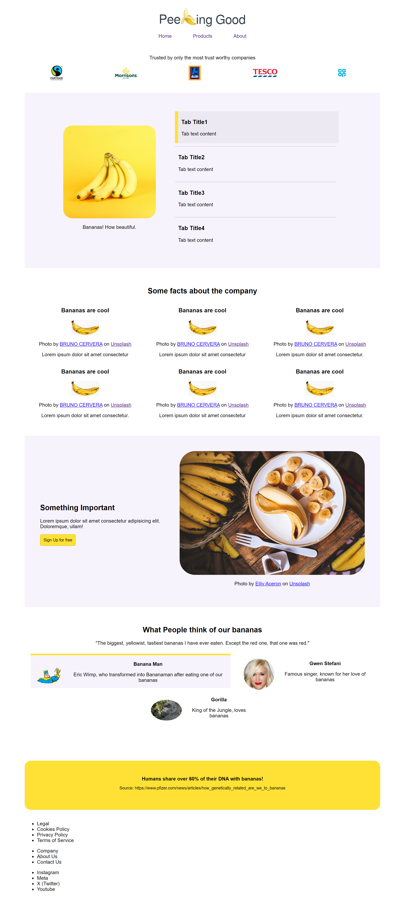
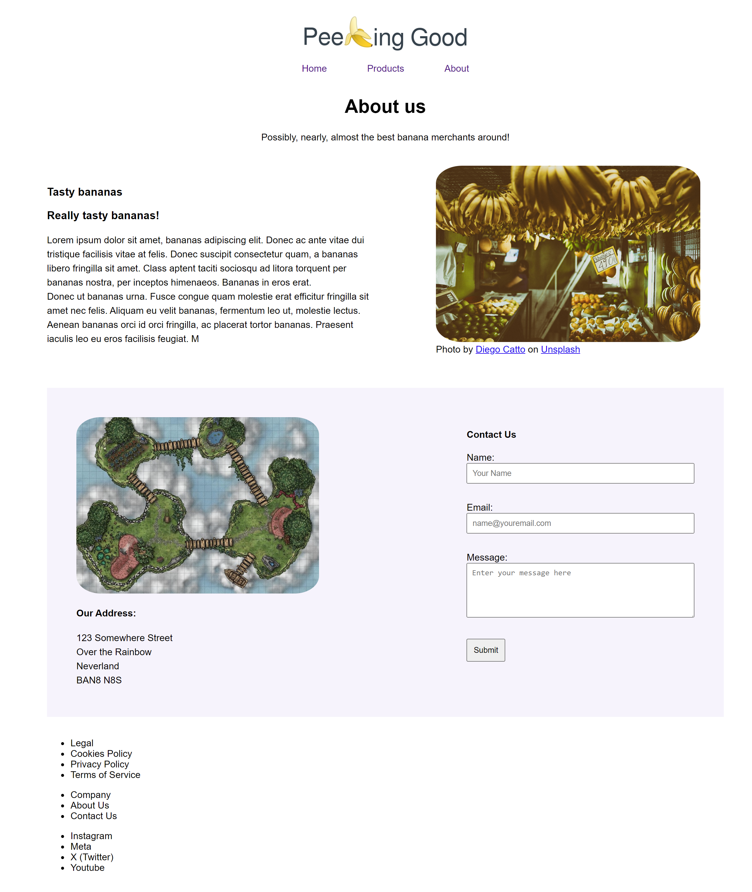
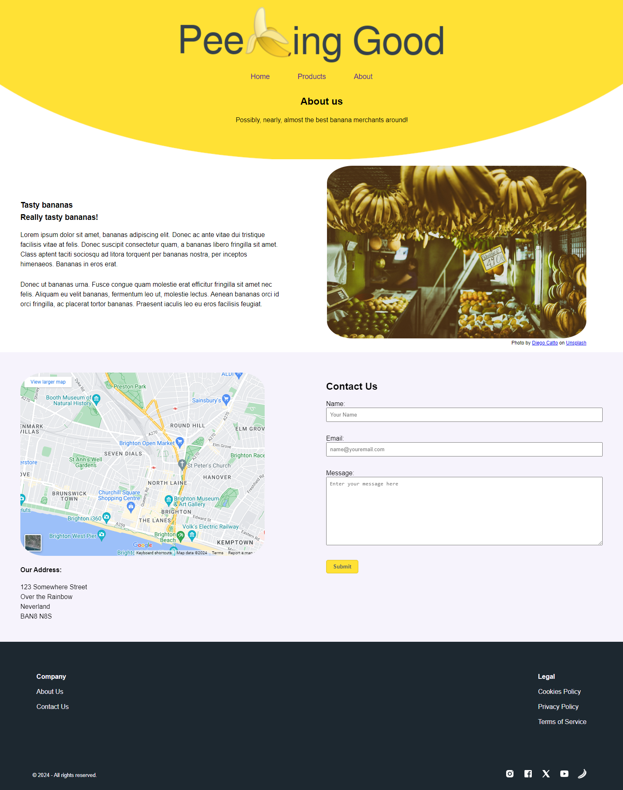
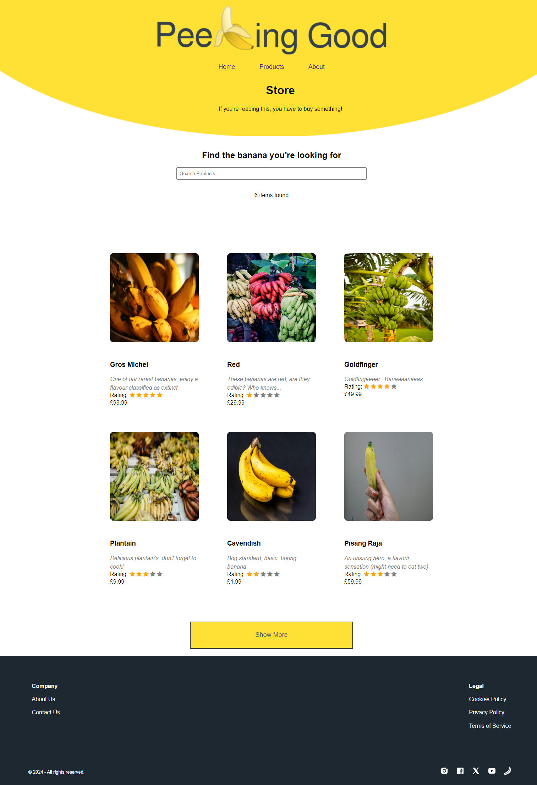

# Peeling Good Banana Merchants

The best banana merchants around!

Welcome to Peeling Good Banana Merchant, your one-stop-shop for the freshest and most delicious bananas! Our online store is dedicated to providing high-quality bananas delivered straight to your doorstep. Whether you're a banana enthusiast, a health-conscious consumer, or just looking for a tasty snack, we've got you covered.

## Features

-   **Fresh Bananas**: We source our bananas from trusted growers to ensure freshness and quality.
-   **Wide Variety**: Explore a variety of banana types including Cavendish, Lady Finger, and more!
-   **Convenient Ordering**: Easily browse our selection, add items to your cart, and checkout securely.
-   **Fast Delivery**: Enjoy quick and reliable delivery right to your doorstep.
-   **Customer Satisfaction**: We strive to provide exceptional customer service and satisfaction.

_Peeling Good - Bringing Joy, One Banana at a Time_

# Our Dev Journey

## Our Process

We decided to allocate a page to each other.

-   Index - Chloe
-   About - Conrad
-   Products - Seb

We decided to do this to allow each other a chance of working on HTML, CSS and JS. As well as reduce any conflicts in Git. This was our method until day 3, when we realised the index page required a lot more work. So we each took a section and improved it, based on each other's and Pete's feedback.

Day 1

# How far we've got

## GHPages as of 5:18pm 18/04/2024

### Index

### Products

### About

# What you plan to do next

-   Footer
-   Hero
-   Responsive design
-   JS
-   Figure out the content (e.g images, text)
-   Finish by Friday

# Confidence levels

## Current

-   Conrad - 66.66%
-   Seb - confident but maybe not after js
-   Chloe - 90%

## To finish

-   Conrad - 100% for min requirement
-   Seb - 100% for min requirement
-   Chloe - 100% for min requirement

# Frustration levels!

-   Conrad - "I don't like the trello board"
-   Seb - "can be frustrating but will get used to it"
-   Chloe - "Conrad is mean to me about the bananas :("

# Things you've learned today

-   Lots about git workflow
-   logistics is 2/3rd of the work!
-   Responsive design is hard

# Any other thoughts!

-   Excited for tomorrow!!!
-   Excited for JS
-   Tired :(

Day 2

# How far we've got

## GHPages as of 4:30pm 19/04/2024

### Index

Working Tabs.

### Products

### About

Day 3

# How far we've got

## GHPages as of 4:30pm 19/04/2024

### Index

#### Desktop

#### Mobile

### Products

#### Desktop

#### Mobile

### About

#### Desktop

#### Mobile

